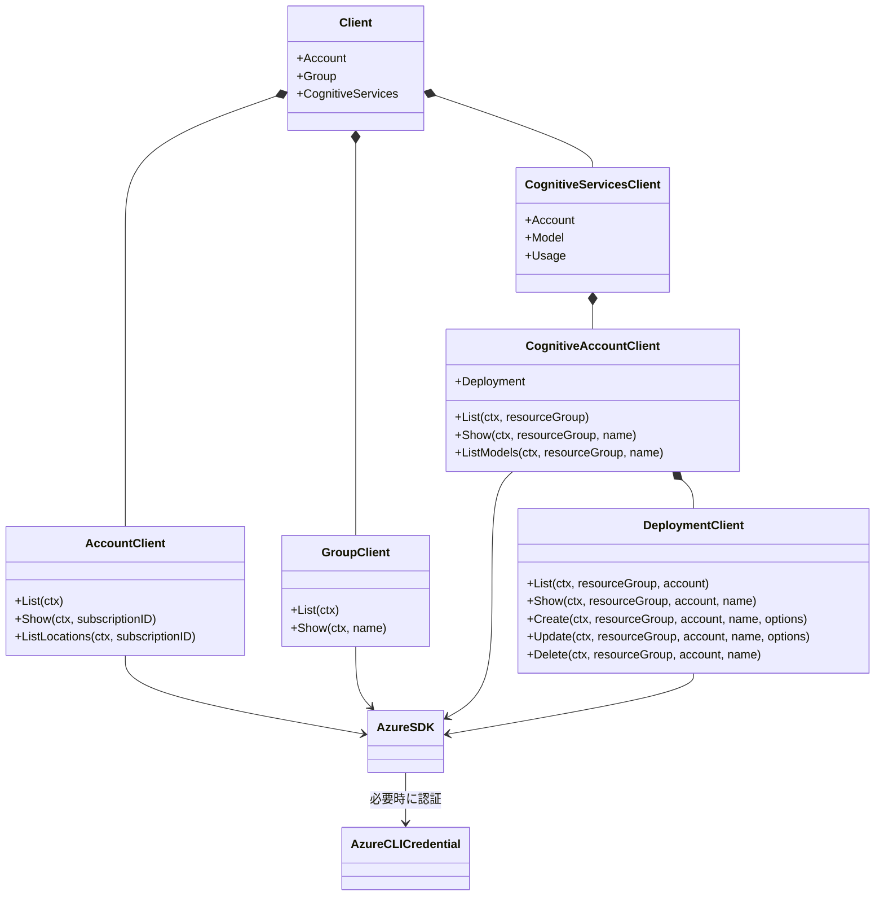
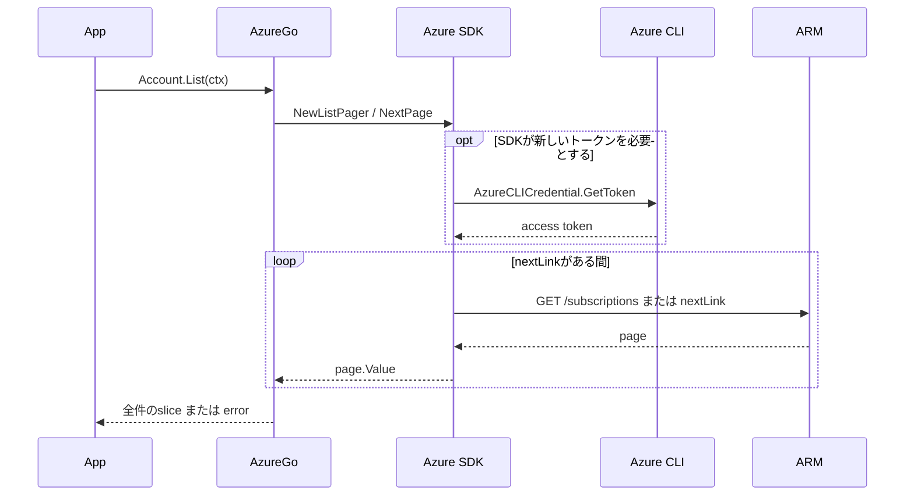
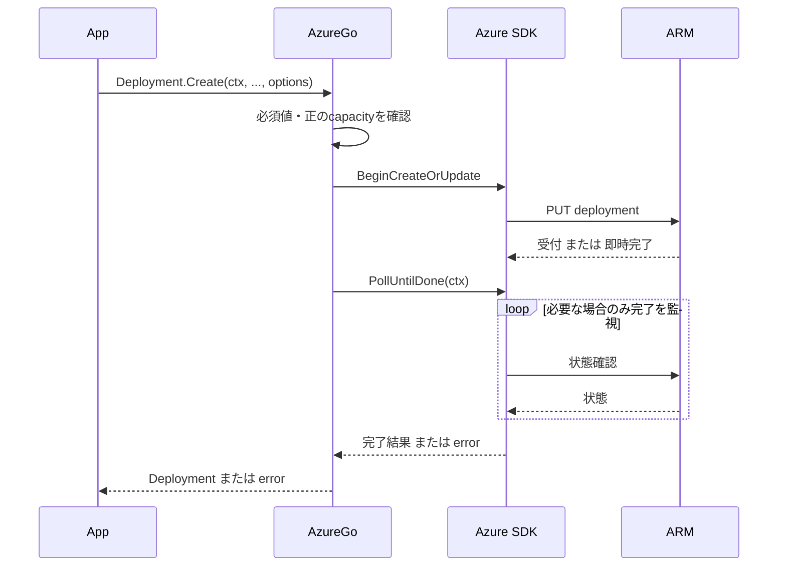

# アーキテクチャ

AzureGoはCLIの操作体系を参考にしたFacadeです。CLIの振る舞い全体を再実装するものではありません。

```text
呼び出し元 → AzureGo → Azure SDK for Go → ARM REST API
                            │ 認証が必要なとき
                            └→ AzureCLICredential → az account get-access-token
```

認証はAPI呼び出しの前提として並行する関心事であり、REST APIアクセスがCLI経由になるわけではありません。
SDKのBearer Tokenポリシーにトークン利用を任せ、独自の永続トークンキャッシュは持ちません。
`AzureCLICredential.GetToken` 自体はCLIを起動するため、「CLI起動はプロセス全体で一回だけ」とは保証しません。

## クラス図（Goのstruct）



## 一覧取得



## モデルデプロイの作成／変更



`Update` はSKU／容量だけのPATCH、`Delete` はDELETEです。いずれもSDKの完了待ちを使用します。
認証の図示は一覧取得と同じため省略しています。

## 設計上の境界

`New` はローカルな構築だけを行います。Subscription未指定でも名前空間を作成し、
スコープが必要な操作で明示的なエラーを返します。CLIの既定Subscriptionの自動選択はしません。

公開モデルはSDK型のエイリアス、操作の戻り値はモデルまたはスライスです。
全ページのメモリ保持が適さない規模になった場合に限り、別途ストリーミングAPIを検討します。

独自Repository／Provider抽象化、バックグラウンド更新、データキャッシュ、永続化、
秘密情報保管、汎用CLIラッパーはありません。
